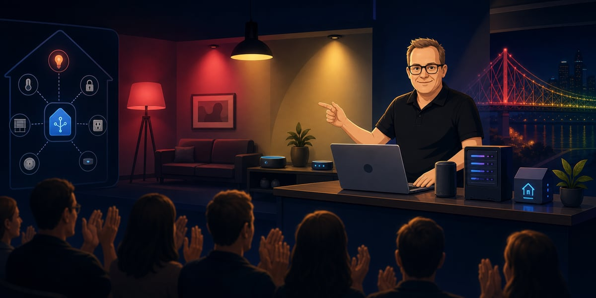

### Hi there 👋

I'm Jernej Kavka but you can call me JK. 😁

I’ve been building AI-adjacent projects since the early 2010s, from Kinect games and gesture engines to Cortana bots and computer vision apps.

- 💻 I currently work at SSW - check out my other profile: https://www.ssw.com.au/people/jk
- 🔭 I’m currently working on teaching and learning various AI communities in Brisbane as a volunteer organiser and presenter
- 🌱 I’m currently learning .NET 10, efficient EF Core, Ambient Intelligence, LLM, NUI and second digital brain
- 🎤 I'm (co)organizer of [Global AI The Podcast](https://globalai.live/ai-the-podcast/), [Brisbane Build Club](https://www.meetup.com/build-club-brisbane/) City Lead and a few other events
- 👯 I’m looking to collaborate on building AI, Blazor projects and/or learning material
- 🤔 I’m looking for help with building AI and automation projects, especially for personal
- 💬 Ask me about .NET Core, EF Core, Cognitive Services, ML.NET, Blazor, Azure Functions, ChatGPT, future of AI
- ♥️ I support many organizations, projects and developers on GitHub and [OpenCollective](https://opencollective.com/jernej-kavka)
- 📫 How to reach me: @jernej_kavka
- 😄 Pronouns: He/Him
- 🐾 Created a familiar Codex pet — [petdex.crafter.run/pets/jk](https://petdex.crafter.run/pets/jk)
- ⚡ Fun fact: Back in 2015, I created an AI agent that could make me a sandwich just to win a bet.

## GitHub Stats

<a href='https://github.com/jernejk'>
  <picture>
    <source media="(prefers-color-scheme: light)" srcset="https://github-readme-stats-sigma-five.vercel.app/api?username=jernejk&show_icons=true&count_private=true">
    
  </picture>
</a>

<a href='https://github.com/jernejk'>
  <picture>
    <source media="(prefers-color-scheme: light)" srcset="https://github-readme-stats-sigma-five.vercel.app/api/top-langs/?username=jernejk&layout=compact">
    
  </picture>
</a>

## Demo people remember

Local/offline AI + MCP + Home Assistant, matching the Story Bridge colours live on stage.
